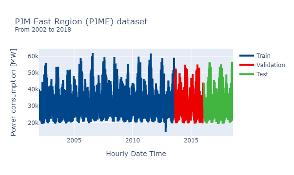
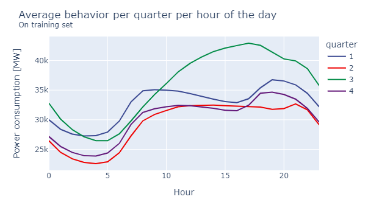
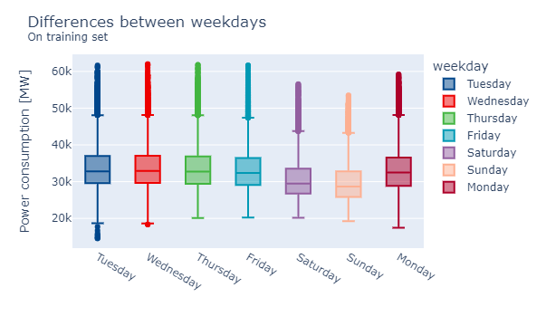

```{r setup, include=FALSE}
knitr::opts_chunk$set(echo = FALSE, cache=FALSE, message=FALSE, hide = TRUE, warning = FALSE)
library(data.table)
library(knitr)
```


## Overview
<div style="text-align: justify"> 
This project pretends to develop a forecasting model based on the article **“Genetic Algorithm Based Optimized Feature Engineering and Hybrid Machine Learning for Effective Energy Consumption Prediction”** (P. W. Khan and Y. -C. Byun, [IEEE Access](https://ieeexplore.ieee.org/stamp/stamp.jsp?arnumber=9240924)). That work proposes a time series model ensembled from 3 machine learning algorithms: XGBoost, Support Vector Regressor, and K-nearest neighbors. The forecasting application is in the field of electric energy consumption. The Hourly Energy Consumption dataset, from Kaggle.com, trains the aforementioned models. The three algorithms will be evaluated separately and jointly. 

</div>

## Data exploration
The data were collected from January 1, 2002, at 1 AM until August 3, 2018, at 3 AM, given a total of 113927 entries. This dataset was split into training and test sets on January 1, 2015, at 0 AM. The first features were made from the collected date. These features are:

- Day of week  
- Day of year  
- Year  
- Month  
- Quarter  
- Hour  
- Week of year  
- Date of month  

With those features, it was possible to make exploratory images showing information about the collected energy consumption measures. All plots correspond to the training set. In the first instance, the entire data is plotted:

  
Although specific periods are not visible, this image shows a strong seasonality within a year (due to those four shape valleys every 2 years), as well as a cyclic behaviour. The next images will be 2D histograms: one referred to the samples:  

  
and other referred to the difference between a sample and its previous sample:  

  
These images show that the most common measures are between 30.000 and 35.000 MW, and the most common difference between continuous samples is between 0 and 500 MW. The next image pretends to give an overview of the energy consumption per month. In each of the cells is the median of all measures that correspond to a specific year and a specific month:    

  
The previous image depicts that the months in where the energy consumption is greater are July and August. This conclusion can be corroborated in the next image. That corresponds to the trend of energy consumption per quarter-hour:  

  

Here, the months that have the highest energy consumption in most of the day are July, August, and September. The final plot in this exploratory analysis is the distribution of samples grouped by hour of the day:



This graph shows that the weekends are the days in where there is less energy consumption.

## Analysis of results
Working on it ;)
 
### Reference Paper  
P. W. Khan and Y. -C. Byun, "Genetic Algorithm Based Optimized Feature Engineering and Hybrid Machine Learning for Effective Energy Consumption Prediction," in IEEE Access, vol. 8, pp. 196274-196286, 2020, doi: 10.1109/ACCESS.2020.3034101.