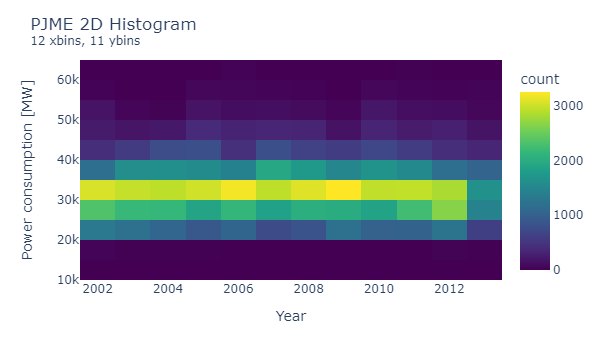
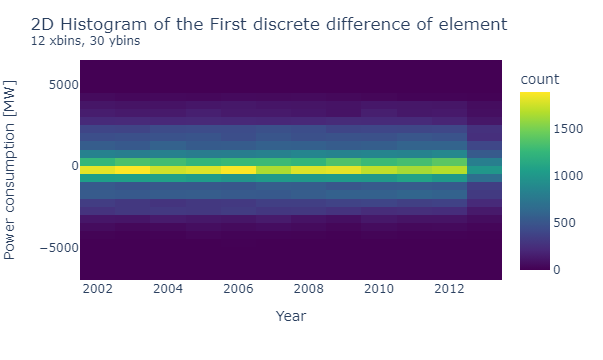
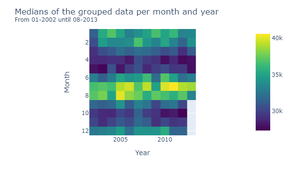

Ensemble Machine Learning Model for Time Series
================
Fernando Garcia
9/2/2021


## Overview

<div style="text-align: justify">

This project pretends to develop a forecasting model based on the
article **“Genetic Algorithm Based Optimized Feature Engineering and
Hybrid Machine Learning for Effective Energy Consumption Prediction”**
(P. W. Khan and Y. -C. Byun, [IEEE
Access](https://ieeexplore.ieee.org/stamp/stamp.jsp?arnumber=9240924)).
That work proposes a time series model ensembled from 3 machine learning
algorithms: XGBoost, Support Vector Regressor, and K-nearest neighbors
regressor.

The forecasting objective is to predict the hours when the power
consumption is minimum and maximum. This kind of prediction is useful to
optimize the charging and discharging of batteries in an industrial
context. This activity leads to generate savings, optimizing the power
quality, and reducing the carbon footprint generated by the company.
This project uses the [Hourly Energy Consumption
dataset](https://www.kaggle.com/robikscube/hourly-energy-consumption)
took from Kaggle.com. This dataset will train the three models mentioned
in the reference paper. All algorithms will be evaluated separately and
jointly (using a k-nearest neighbor approach) for the hour of the
minimal energy consumption and the hour of the maximum energy
consumption.

The steps to carry out this project are:

  - Load and clean the data  
  - Generation of features and Data Exploration  
  - Train the models  
  - Perform all prediction  
  - Evaluate the results  
  - Conclusions

</div>

## Load and clean the data

The data were collected from January 1, 2002, at 1 AM until August 3,
2018, at 3 AM, given a total of 113927 entries. This dataset was split
into training, validation, and test set considering the 70%, 15%, and
15% of the entire dataset respectively.

The hosted datasets from Kaggle.com usually are cleaned, so an
exhaustively cleaning will be not necessary. Nevertheless, I am
considering the ‘DateTime’ feature as the index and, due to this, it is
to necessary be attentive to two aspects:

1.  Dates when the time changes from summertime to normal time (in these
    cases the missing sample was added with the average of the measures)
2.  Dates when the time changes from normal time to summertime (in these
    cases the extra sample was erased)

## Generation of features and Data Exploration

### Features for the exploration

The first features were made from the collected date. These features
(labeled as date features) are:

  - Day of week  
  - Day of year  
  - Month  
  - Quarter  
  - Hour  
  - Week of year  
  - Date of month

With those features, it was possible to make exploratory images showing
information about the collected energy consumption measures. All plots
correspond to the training set. In the first instance, the entire data
is plotted:

  
Although specific periods are not visible, this image shows a strong
seasonality within a year (due to those four shape valleys every 2
years), as well as a cyclic behaviour. The next images will be 2D
histograms: one referred to the samples:

  
and other referred to the difference between a sample and its previous
sample:

  
These images show that the most common measures are between 30.000 and
35.000 MW, and the most common difference between continuous samples is
between 0 and 500 MW. The next image pretends to give an overview of the
energy consumption per month. In each of the cells is the median of all
measures that correspond to a specific year and a specific month:

  
The previous image depicts that the months in where the energy
consumption is greater are July and August. This conclusion can be
corroborated in the next image. That corresponds to the trend of energy
consumption per quarter-hour:


Here, the months that have the highest energy consumption in most of the
day are July, August, and September. The final plot in this exploratory
analysis is the distribution of samples grouped by hour of the day:


This graph shows that the weekends are the days in where there is less
energy consumption.

### Features for training the models

For the forecasting task all three algorithms would use the same
predictors. These predictors will be shifted and grouped features (the
standard deviation and the mean of the grouped features). In initial
model responses that used the last 12 measures as predictors are not
capable to model the energy consumption patter. In the next figure you
can see one of the responses of these models:  


The first discrete difference image shows that the most common
difference between samples are +-500 MW, so successive features will
model this behavior. To overcome this difficulty, the shifts and grouped
features will be:

``` r
previous_samples_positions = c(1, 3, 5, 9, 11)
previous_group_of = c(6, 12)
```

Also, the models was trained to give the next 6 measures instead only
one.

## Train the models

How I mentioned before, the project uses multi-output models with a
prediction horizon of six, and all models are trained using the same
features.

### XGBoost model

This model was trained using the date features, the shifted samples, the
mean and the standard deviation of the grouped data. The model was 2000
estimators, a maximum depth of 10, and a learning rate of 0.01. This
training lasted 4 hours to be completed.

### SVR model

For this model is necessary to do a couple of additional steps in the
training data:

1.  Convert date features from a linear to circular approach
2.  Scale the features into a range from 0 to 1

The model uses a radial basis function as kernel (RBF). This kernel is
based on the squared Euclidean distance and this considers dates as
January 31 and February 1 as distant. Circular features are used to
overcome this problem (on date features). The model uses a regulation
parameter of 1000, and a kernel coefficient of 0.1 for RBF. In [this
link](https://scikit-learn.org/stable/auto_examples/svm/plot_rbf_parameters.html#sphx-glr-auto-examples-svm-plot-rbf-parameters-py)
you can read more about the effect of these parameters for the RBF
kernel in SVR. This training lasted 19 hours to be completed.

### k-NN regressor model

This model uses the same features than the SVR model as predictors. The
number of neighbors to do the regression is five and the closer
neighbors of a query point will have a greater influence than neighbors
which are further away. This training lasted a few of seconds to be
completed.

## Perform the predictions and evaluate the results

The first response to ensure that all models give good results consist
on perform successive predictions. This task consists on consider
previous responses to compute new predictions. The following image shows
how the models respond o this evaluation (click
[here](https://htmlpreview.github.io/?https://github.com/and88x/afp002_Energy-Consumption-Prediction/blob/main/imgs/90_recursive_predictions.html)
to see details):


The mean absolute errors were 547, 507, and 700 for the SVR, XGBoost,
and KNNR models respectively. With this image, it is possible to ensure
that all models give good responses.

One prediction of the minimum consumption looks like the next image
(click
[here](https://htmlpreview.github.io/?https://github.com/and88x/afp002_Energy-Consumption-Prediction/blob/main/imgs/minimal_consuption.html)
to see details):


One prediction of the maximum consumption looks like the next image
(click
[here](https://htmlpreview.github.io/?https://github.com/and88x/afp002_Energy-Consumption-Prediction/blob/main/imgs/maximum_consuption.html)
to see details):


In the previous images, the measures signal refers to the previous
measures that were considered to compute the predictors (date or
circular, shifted, and grouped features).

## Evaluating the results

After getting the three predictions, a k-nearest neighbor classification
was performed to obtain the final result. The next table summarizes the
accuracy of each model:

| Ensemble model | XGBoost model | SVR model | KNNR model |
| :------------: | :-----------: | :-------: | :--------: |
|     0.518      |     0.599     |   0.299   |   0.409    |

Accuracy to minimum consumption hour

| Ensemble model | XGBoost model | SVR model | KNNR model |
| :------------: | :-----------: | :-------: | :--------: |
|     0.905      |     0.937     |   0.825   |    0.89    |

Accuracy to maximum consumption hour

## Conclussions

Observing the accuracy tables we can note that the XGBoost model has the
best responses. This algorithm has the advantage that its training time
is relatively short compared with the SVR training time. Also, the
XGBoost model doesn’t need the extra pre-processing features such as the
KNNR and SVR models (circular features and the standard scaler from 0 to
1). Though all models have good predictions for the maximum consumption
time, it is necessary to adjust the models or the parameters for the
minimum consumption time. Maybe a model focused only on this task helps
to improve this part of the responses. Practical uses of this work will
need to predict more time for the minimum consumption time. This is due
that the batteries usually need more time to charge compared to the time
needed to discharge them. To overcome this problem the charging time can
be assigned around the predicted hour of the minimum consumption time.

### Reference Paper

P. W. Khan and Y. -C. Byun, “Genetic Algorithm Based Optimized Feature
Engineering and Hybrid Machine Learning for Effective Energy Consumption
Prediction,” in IEEE Access, vol. 8, pp. 196274-196286, 2020, doi:
10.1109/ACCESS.2020.3034101.
